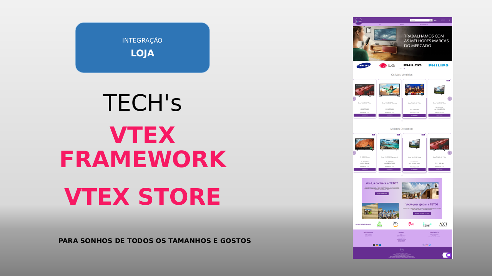
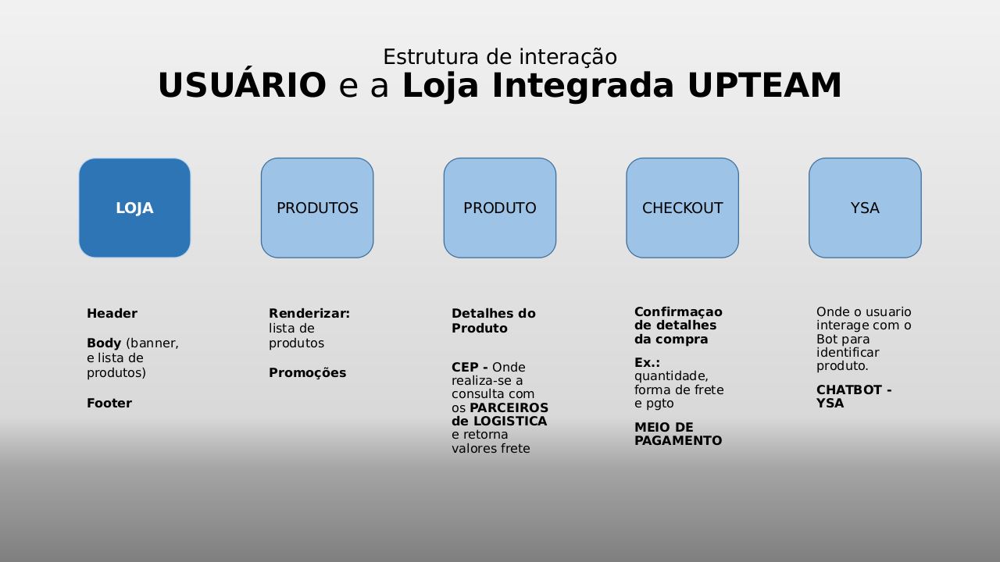
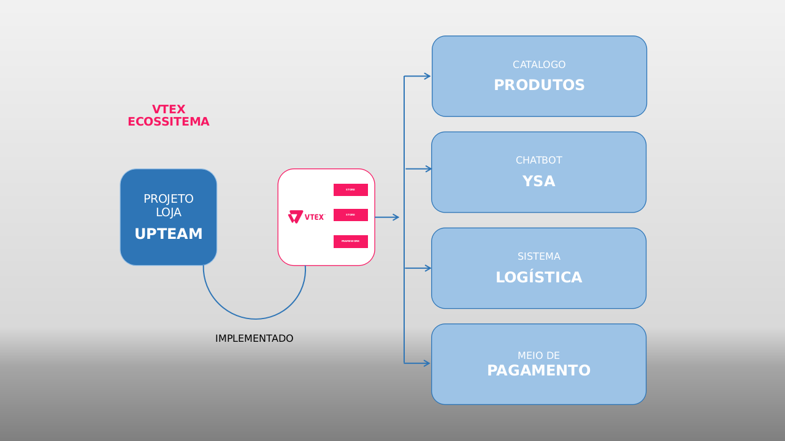
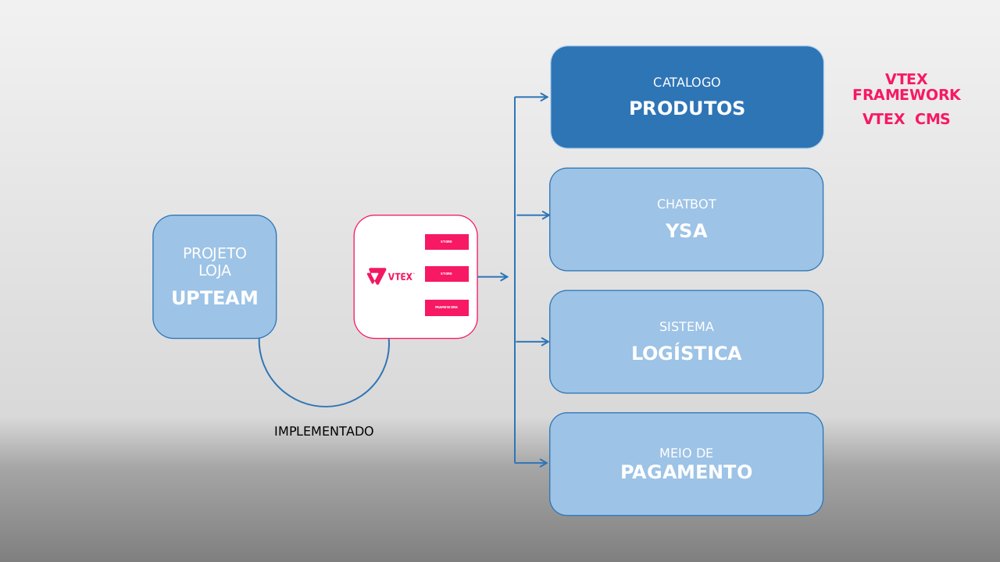
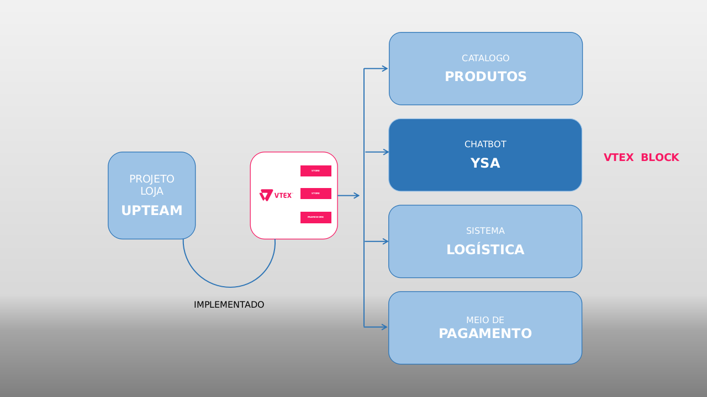
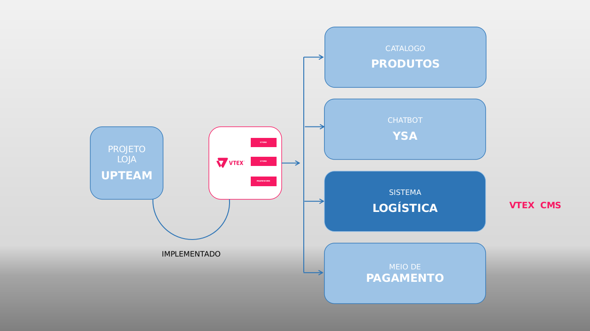
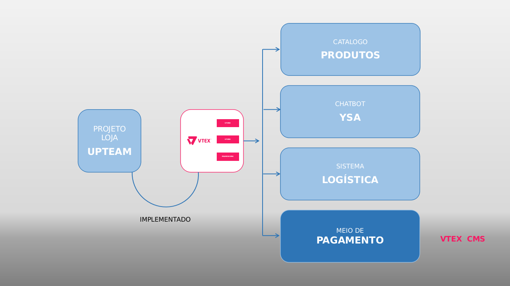

## Agradecimento à **`VTEX`** & **`GAMA ACADEMY`**

&nbsp;

A loja **`UPTEAM`** nasceu por causa da parceria entre a VTEX e a GAMA ACADEMY, que promoveu o desenvolvimento de hard e soft skills de mais de 3000 pessoas.

Eis que concluímos o encerramento desse treinamento, na Vtex Treining Week, 21 à 25 de Setembro de 2020, com os 150 melhores desenvolvedores.

Graças à todo esse período crescemos, aprendemos, conhecemos mais de cada um de nós, e hoje somos um incrível time.

&nbsp;

&nbsp;

---

## OBJETIVO DO PROJETO

&nbsp;

Apresentar a missão da **`UPTEAM`**, seus desafios, e qual solução foi implementada para ir além de satisfazer seus desafios, mas também permitir sua expansão futura.

&nbsp;

---
## Projeto Loja Integrada **`UPTEAM`**

##### **PARA SONHOS DE TODOS OS TAMANHOS E GOSTOS**

&nbsp;

Como quando mudamos de casa, trocamos a mobília; precisamos crescer e expandimos a forma de interagir com o mundo.

Já que **`nossas telas crescem`** e **`nossos gostos são únicos`**, é que o projeto **`UPTEAM`** tomou corpo.

&nbsp;

Para cumprir nossa missão mapeamos nossas dores primárias e resultando numa série de requisitos de necessários para solucionar o problema e desenvolver o sistema .

&nbsp;

### NOSSOS DESAFIOS

&nbsp;

1. Implantação de ecommerce para cumprir nossa missão.
2. Flexibilidade quanto ao formatos de:
    - Pagamentos;
    - Flexibilidade da lista de produtos como: Deletar, Criar ou Alterar;
    - Atendimento automático e personalizável;
    - Disponibilizar de diversos meios para enviar de produtos.
3. Promover IMPACTO SOCIAL que promova o bem estar coletivo;
4. Proporcionar **experiência** agradável e ser referência para nossos consumidores.

&nbsp;

### PROPOSTA DE MELHORIA ATUAL - `O QUE` vs `COMO`

&nbsp;

1. Olhamos para algumas alternativas, porém, ao confrontar com o ecosistema disponibilizado pela VTEX e utilizando recursos fornecidos pela AWS, as dores que enfrentamos além de serem resolvidas, temos um gigantesco suporte de ferramentas que ajudaram na expansão conforme impactamos mais e mais pessoas. Paramos de pensar no **`COMO`**, agora o foco é **`O QUE`** queremos.

2. Da plataforma VTEX, temos a possibilidade de por meio do centro de CMS:
    - Cadastrar diversos meios de pagamentos de forma fácil e rápido;
    - Criar, alterar e/ou excluir produtos e categorias;
    - Uso da **`AWS`** com bots personalizados para atender cada tipo de categoria de produto, pensa numa experiência única?
    - Cadastrar novas parceiras com empresas de logística de forma rápida.

3. Famos parte para que aumente a interação social, e que o impacto seja social e em conjunto, e não individual, por isso o apoio a ONG's que fazem a diferença como a **`TETO`**.

4. Com essa preocupação em expansão e criar uma sociedade mais humana, e que dos recursos digitais também se proporcione uma agradável experiencia ao usuário, nos tornamos referência, nos inspiramos e inspiramos aqueles que querem fazer a diferença no mundo.

&nbsp;

&nbsp;

---

## ESTRUTURA PROJETO

&nbsp;

Nossa missão é participar e proporcionar o crescimento de cada pessoa, temos sua conclusão, no aspecto de produtos, promovemos a aquisição de **TV's**, **AUDIOS** e **ACESSÓRIOS** que fazem parte deste universo.

Para atender necessidades atuais, nossa loja virtual foi implementada no Ecosistema VTEX, com foco nas seguintes divisões básicas que faz com que nossa loja crie vida:

1. `Loja Integrada » layout, interligação e estrutura da página`
1. `Catálogo de Produtos` 
2. `Chatbot - YSA - Your Shippiment Assistent` 
3. `Sistema de Logística` 
4. `Sistema de Pagamento` 

&nbsp;

&nbsp;

---

## LOJA INTEGRADA » `VTEX FRAMEWORK`

&nbsp;

&nbsp;

---

## CATÁLOGO DE PRODUTOS » `VTEX CMS`

&nbsp;

&nbsp;

---

## CHATBOT YSA » `VTEX BLOCK`

&nbsp;

&nbsp;

---

## PARCEIROS DE LOGÍSTICA » `VTEX CMS`

&nbsp;

&nbsp;

---

## MEIOS DE PAGAMENTO » `VTEX CMS`

&nbsp;

&nbsp;

---

## EQUIPE

&nbsp;

|Membro|Nome|Linkedin|Git|
|---|---|---|---|---|
||Alexanre|[in-alexandre-moreira](https://www.linkedin.com/in/in-alexandre-moreira) | [alexandre-moreira](https://github.com/alexandre-moreira) |
||Carolina|[caroline-casagrande-992a3911](https://www.linkedin.com/in/caroline-casagrande-992a3911) | [carolcasagrande](https://github.com/carolcasagrande) |
||Eduardo|[eduardo-rodrigues-41448a125](https://www.linkedin.com/in/eduardo-rodrigues-41448a125/) | [EduardoRS78](https://github.com/EduardoRS78) |
||Elton|[elton-dmsantos](https://www.linkedin.com/in/elton-dmsantos/) | [eltondouglas](https://github.com/eltondouglas) |
||Hernani|[nanialmeida](https://www.linkedin.com/in/nanialmeida/) | [2020nani](https://github.com/2020nani) |
||Jefferson|[jeffersonrodriguesdasilva](https://www.linkedin.com/in/jeffersonrodriguesdasilva/) | [Jeffrs123](https://github.com/Jeffrs123) |
||Natanael|[natanael-esdras](https://www.linkedin.com/in/natanael-esdras/) | [esdrasli](https://github.com/esdrasli) |
||Paulo|[paulo-cortes](https://www.linkedin.com/in/paulo-cortes) | [pcrts](https://github.com/pcrts) |
||Renato|[rpessoaneto](https://www.linkedin.com/in/rpessoaneto/) | [pessoas](https://github.com/pessoas) |
||Vinicius|[viniciustito](https://www.linkedin.com/in/viniciustito/) | [viniciusrtito](https://github.com/viniciusrtito) |
&nbsp;

